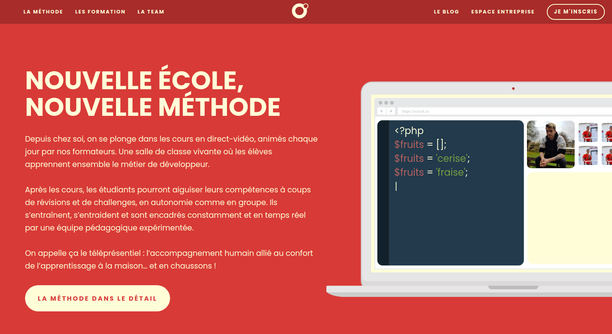

# Clone o'clock

Le but de ce projet est de cloner la page d'accueil du site o'clock. Ce projet à été réalisé uniquement en HTML, CSS et JavaScript Vanilla.

Vous pouvez accéder au rendu du site en [cliquant ici](https://nathanguyard.github.io/Clone-Oclock/ "Rendu du site").

N'hésitez à partager le projet sur Linked-In si vous l'avez aimé !

Pour accéder à mon profil Linked-In, [cliquez ici](https://www.linkedin.com/in/nathan-guyard-619311210/ "Mon profil Linked-In") !

Ce projet à été réalisé en collaboration avec [Guillaume Pirard](https://www.linkedin.com/in/guillaume-pirard/ "Profil Linked-In").
